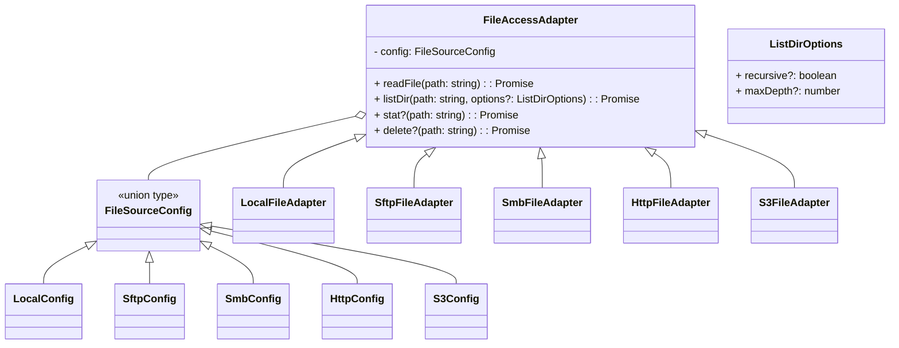

# File Access Adapter Design

This document describes the architecture and interface for file access adapters used throughout the project. The goal is to provide a unified, read-only API for retrieving and enumerating files from various back-ends (local disk, remote servers, cloud storage, etc.).

## Concepts

- **`FileSourceConfig`**: a discriminated union containing configuration for each supported adapter type.
- **`FileAccessAdapter`**: an abstract base class defining the public methods available to callers.
- **Concrete adapters**: classes that extend `FileAccessAdapter` and implement functionality for a specific backend (e.g. `LocalFileAdapter`, `SftpFileAdapter`).
- **Factory**: a helper that instantiates the correct adapter based on a configuration object.

## Configuration types

Each backend has a corresponding configuration interface; these are combined into `FileSourceConfig`.

Example definitions:

```ts
export type LocalConfig = { type: "local"; basePath: string };
export type SftpConfig = { type: "sftp"; host: string; port?: number; username: string; password?: string; privateKey?: string|Buffer; root?: string };
export type SmbConfig = { type: "smb"; share: string; username?: string; password?: string; domain?: string };
export type HttpConfig = { type: "http"|"https"; baseUrl: string; headers?: Record<string,string> };
export type S3Config = { type: "s3"; bucket: string; region?: string; credentials?: { accessKeyId: string; secretAccessKey: string; sessionToken?: string } };

export type FileSourceConfig =
  | LocalConfig
  | SftpConfig
  | SmbConfig
  | HttpConfig
  | S3Config;
```

Additional configurations may be added for Azure, GCS, archive, database stores, etc.

## Adapter interface

The base class offers a read-only contract with optional helpers and recursion control for directory listings.

```ts
export abstract class FileAccessAdapter {
  constructor(protected readonly config: FileSourceConfig) {}

  abstract readFile(path: string): Promise<Buffer>;

  /**
   * Options that control directory enumeration behavior.
   */
  export interface ListDirOptions {
    recursive?: boolean;
    maxDepth?: number;
  }

  abstract listDir(path: string, options?: ListDirOptions): Promise<string[]>;

  stat?(path: string): Promise<any>;
  delete?(path: string): Promise<void>;
}
```

### Methods

- `readFile(path)` – returns a `Buffer` with file contents.
- `listDir(path, options?)` – lists entries; options can request recursive traversal and limit depth.
- `stat(path)` *(optional)* – metadata for a path.
- `delete(path)` *(optional)* – remove a file.

## Concrete adapters

Each adapter implements the required methods and any supported optional ones.

- **LocalFileAdapter** – uses Node `fs`; supports `stat`/`delete`.
- **SftpFileAdapter** – uses `ssh2-sftp-client`; supports `stat`, `delete`, and connection management.
- **SmbFileAdapter** – uses `smb2`; supports `delete`.
- **HttpFileAdapter** – uses `axios`; listing and reading are HTTP requests.
- **S3FileAdapter** – uses `@aws-sdk/client-s3`; supports `delete`.

(Adapters for other sources can follow the same pattern.)

## Factory

The `createFileAdapter` function chooses the correct subclass for a given config:

```ts
export function createFileAdapter(config: FileSourceConfig): FileAccessAdapter {
  switch (config.type) {
    case "local": return new LocalFileAdapter(config as LocalConfig);
    case "sftp": return new SftpFileAdapter(config as SftpConfig);
    case "smb":  return new SmbFileAdapter(config as SmbConfig);
    case "http":
    case "https": return new HttpFileAdapter(config as HttpConfig);
    case "s3": return new S3FileAdapter(config as S3Config);
    default:
      throw new Error(`unsupported file adapter type: ${(config as any).type}`);
  }
}
```

## UML Class Diagram



## Usage example

```ts
const config: FileSourceConfig = { type: "sftp", host: "x", username: "u" };
const adapter = createFileAdapter(config);
const files = await adapter.listDir("/logs", { recursive: true, maxDepth: 3 });
const data = await adapter.readFile("/logs/today.txt");
```

## Extensibility

- Add new `*Config` union members and adapter subclasses.
- Update factory switch-case.
- Ensure adapters honour `ListDirOptions` semantics.

---

This markdown captures the class-level design, method signatures, and planning details for implementing and extending file access adapters in the project.